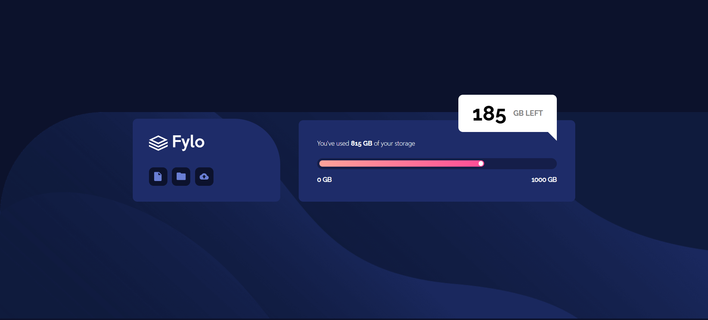

# Frontend Mentor - Fylo data storage component solution

This is a solution to the [Fylo data storage component challenge on Frontend Mentor](https://www.frontendmentor.io/challenges/fylo-data-storage-component-1dZPRbV5n). Frontend Mentor challenges help you improve your coding skills by building realistic projects. 

## Table of contents

- [Overview](#overview)
  - [The challenge](#the-challenge)
  - [Screenshot](#screenshot)
  - [Links](#links)
- [Author](#author)

## Overview

### The challenge

Users should be able to:

- View the optimal layout for the site depending on their device's screen size

### Screenshot

### Links

- Solution URL: [Solution](https://www.frontendmentor.io/solutions/fylo-data-storage-component-oipVHDUsoS)
- Live Site URL: [Live Site](https://nikita-cheropkin.github.io/FrontendManorProject-5/fylo-data-storage-component/site14.html)

## My process

### Built with

- Semantic HTML5 markup
- Flexbox
- Mobile-first workflow

## Author

- Website - [Cheropkin Nikita](https://www.your-site.com)
- Frontend Mentor - [@nikita-cheropkin](https://www.frontendmentor.io/profile/nikita-cheropkin)
